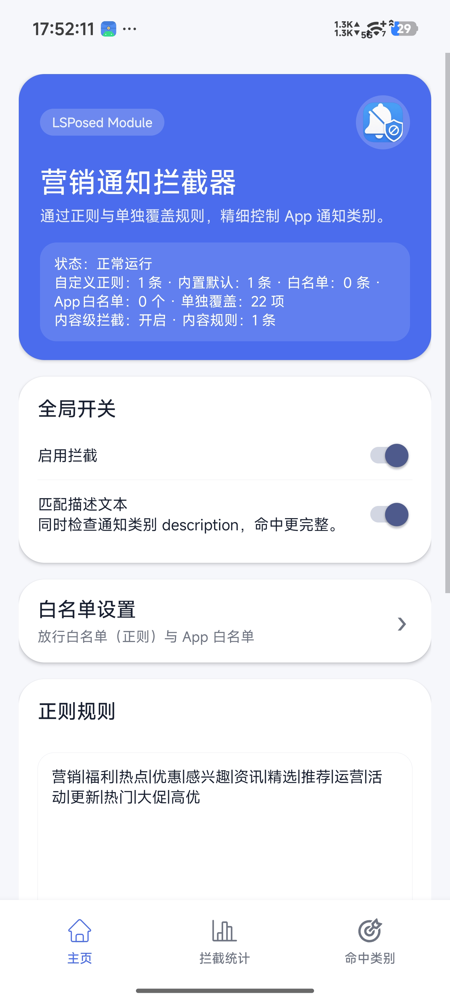
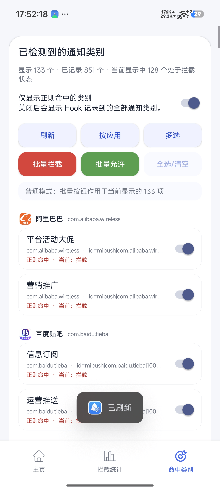
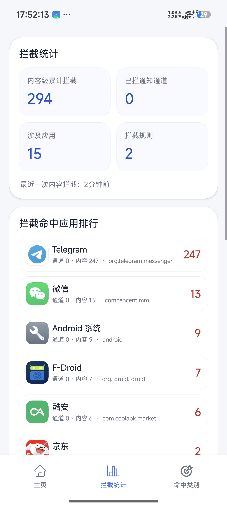

# MarketingNotificationBlocker (营销通知拦截器)

一款轻量级、高效的 Android 通知过滤模块，基于 Xposed / LSPosed 框架开发。它能够深入系统底层，精准拦截并屏蔽各种烦人的营销广告和垃圾推送，让你重新拥有干净、整洁的通知栏体验。

## ✨ 核心特性

* **底层拦截 (Notification Hook)**：在系统层面介入通知生成流程，直接阻断垃圾推送，避免无用通知唤醒屏幕或发出声音。
* **灵活正则 (Regex Configuration)**：支持高度自定义的正则表达式规则，精准匹配广告、营销等特定关键字，告别误杀。
* **渠道管控 (Channel Management)**：深度接管 Android 系统的通知渠道 (Notification Channels)，支持记录并直接冻结流氓软件的特定推送通道，也可对单个渠道单独覆盖开关。
* **内容级拦截（实验性）**：可选按通知的标题/正文直接匹配拦截，用于对付共享或"默认"通道推送的营销通知（这类通知无法靠渠道规则精确区分）。默认关闭，前台服务通知不会被拦截。
* **双层白名单**：正则放行白名单（如验证码、即时通讯类 App）始终优先于拦截规则；此外还有 App 白名单，可让某个 App 的通知（渠道级 + 内容级）完全不受拦截影响。
* **拦截统计**：记录内容级拦截的累计次数与按应用汇总的命中排行，直观了解实际过滤了什么。
* **多语言界面**：支持简体中文与英文，可在"关于"页面切换。
* **轻量高效**：代码结构精简，运行开销极低，内置完善的环境校验与安全机制。
* **安全模式自动保护**：监控系统界面（System UI）是否反复崩溃，若 30 秒内重启超过 2 次，模块会自动停止拦截（不会卸载自身），直到你在 App 内确认规则无误并手动清除该标志。

## 📱 界面截图

<!-- 将对应的 PNG/JPG 图片放入 screenshots/ 目录，保持下面的文件名一致（或按需修改下方路径）。 -->

| 主页 / 规则 | 命中类别 | 拦截统计 |
| :---: | :---: | :---: |
|  |  |  |

## 🛠️ 环境要求

要正常运行本模块，你的设备需要具备以下环境：

* 已解锁 Bootloader 并获取 Root 权限。
* 已正确安装并激活 **LSPosed** 框架。
* 支持的 Android 版本：Android 15 、Android 16（其他安卓版本自测，已在HyperOS3.0、crDroid11.2测试通过）。

## 📦 安装与配置

1.  前往 [Releases](https://github.com/lm060719/io.mo.mnblocker/releases) 页面下载最新版本的 `.apk` 安装包。
2.  在设备上常规安装该 APK 文件。
3.  打开 **LSPosed 管理器**，在“模块”列表中找到 **MarketingNotificationBlocker** 并将其启用。
4.  勾选作用域：**只需勾选“Android 系统框架”即可**。本模块只 Hook 系统框架进程 (system_server)，通知渠道的拦截全部在其中完成，因此**无需**勾选任何具体应用（勾了也不会生效）。
5.  重启设备使模块注入生效（仅重启系统 UI 不足以让系统框架内的 Hook 重新加载）。
6.  打开本模块的用户界面，开始配置你的专属正则表达式和过滤规则。

> 上述"重启设备"仅是首次加载 Hook 到 system_server 所必需的一次性步骤。此后在 App 内修改规则、开关、白名单，会在下一次通知/渠道事件时即时生效，无需再次重启。

## ⚠️ 免责声明

本模块仅供学习与交流 Android 底层 Hook 技术使用。请合理配置拦截规则以免漏接重要通知（如微信、验证码等）。开发者对因使用本模块导致的任何信息遗漏不承担责任。

## 🤝 贡献与反馈

如果你在日常使用中总结出了极其高效的正则屏蔽规则，或者发现了 Bug，非常欢迎提交 **Issue** 或 **Pull Request**！让我们一起完善这个项目。

## 📄 开源协议

本项目基于 [MIT License](LICENSE) 授权。
